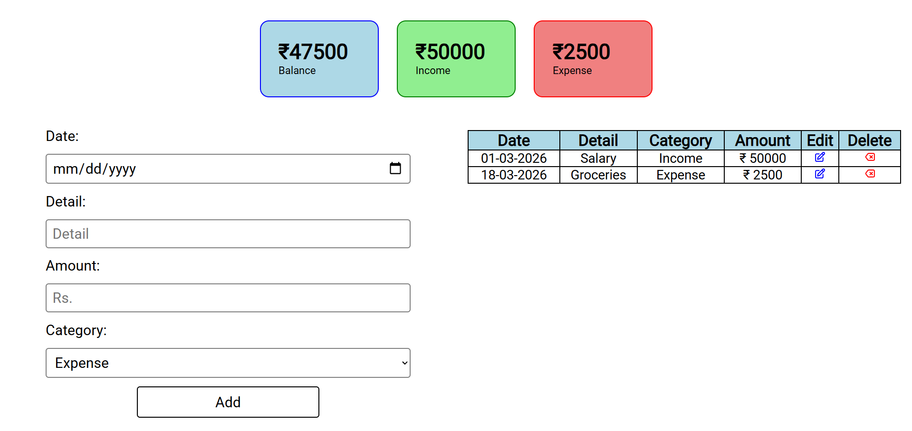

# Expense Tracker (Vanilla JavaScript)

A lightweight expense tracking web application built using Vanilla JavaScript. The application allows users to perform CRUD operations, 
store data using Local Storage, and dynamically update the UI using DOM manipulation.

### Preview

### Live Demo
https://expense-tracker-sigma-fawn.vercel.app/

### Features
- Add, delete and update expenses  
- Real-time balance calculation  
- Data persistence using Local Storage  
- Dynamic UI updates using DOM manipulation  

### Tech Stack
- HTML  
- CSS  
- JavaScript  

### What I Learned
- Implementing CRUD operations using Vanilla JavaScript  
- Managing and persisting data with Local Storage  
- DOM manipulation for dynamic UI updates  
- Handling user input and form validation  
- Structuring clean and maintainable frontend code  
- Improving problem-solving and debugging skills  

### How to Run
- Clone the repository
- Navigate to the project directory
- Open index.html in your browser